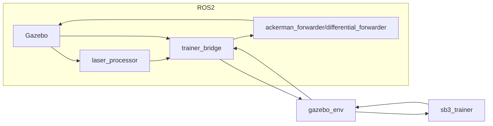

# ROS2-Gymnasium-StableBaselines3
将ROS2封装为Gymnasium环境，并使用Stable Baselines 3进行强化学习

> 项目最开始使用 ROS2 Foxy，后来使用 ROS2 Humble。主要在 ros2 control 插件出有所不同。其他小问题没有控制变量，暂不清楚是不是 ROS2 不同版本引起的问题。
> 
> 最后一次运行项目采用的是 ROS2 Humble。

项目框架

## 项目构成

该项目主要包含两个文件夹：note-typst 和 RGS_DRL。

1. note-typst 中是用 typst 语言编写并生成的 pdf 文件，内容是 ROS2 学习过程中遇到的一些问题。
2. RGS_DRL 是一个 ROS2 项目文件夹。在 src 中包括两个功能包：agent_description 和 drl_trainer。
    1. agent_description 中包括了个模型，ackerman 和 differential。其中 ackerman 是前轮转向模型，这里将两个前轮合并为了一个车轮用于转向；differential 是差动转向模型。分别有对应的 .launch.py 文件。（ackerman 是直接编写的 urdf 模型，sdf 用于确定碰撞体名字；ackerman 是编写的 xacro，依次生成的 urdf 和 sdf）
    2. drl_trainer 中是主要的程序，在 drl_trainer 中：
        1. ackerman_forwarder：用于前轮转向的控制转发器，基于先验知识（如差速模型、阿克曼转向模型）将模型输出分解到具体的控制器。
        2. differential_forwarder：用于差动转向的控制转发器，基于先验知识将模型输出分解到具体的控制器。
        3. extractor：用于 Stable Baselines 3 的特征识别器。
        4. gazebo_env：由 ROS2 封装而成的 Gymnasium 环境。
        5. laser_processor：用于处理雷达数据，将点云转化为深度图像。
        6. sb3_trainer：Stable Baselines 3 训练器。
        7. trainer_bridge：工程核心，负责所有数据的处理，作为 ROS2 各种通信方式与 Gymnasium 之间的桥梁。

## 依赖

`apt_requeriments.txt` 中的是需要使用 apt 安装的 ROS2 依赖，`pip_requeriments.txt` 中的是需要使用 pip 安装的 Python 依赖。

在安装 Stable Baselines 3 时会安装几乎所有依赖，但 ROS2 humble 对 Numpy 有版本要求，需要低于 2，所以这里指定使用 1.26.4。